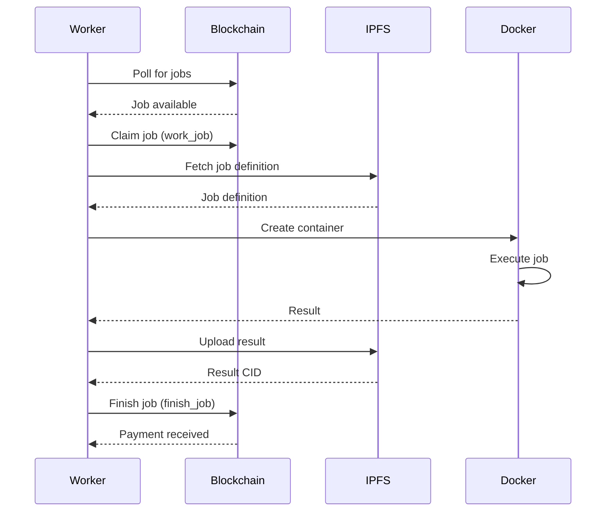

# Hypernode Worker Client

GPU worker client for Hypernode Network. Runs on your GPU machine, executes AI inference jobs, and earns HYPER tokens.

## Overview

The worker client:
- ✅ Registers your GPU with the Hypernode marketplace
- ✅ Polls for available jobs from the blockchain
- ✅ Executes jobs in isolated Docker containers
- ✅ Uploads results to IPFS
- ✅ Receives automatic payments in SOL

## Architecture

```
┌─────────────────────────────────────────────────────────┐
│                    NodeManager                          │
│  (Orchestrates all components)                          │
└─────────────────────────────────────────────────────────┘
           │
           ├─► SolanaClient ──────► Markets Program
           │   (Blockchain interaction)
           │
           ├─► JobHandler ────────► IPFS
           │   (Job orchestration)
           │
           ├─► DockerProvider ────► Docker/Podman
           │   (Container execution)
           │
           ├─► SpecsHandler ──────► nvidia-smi/rocm-smi
           │   (GPU detection)
           │
           └─► HealthHandler ─────► systeminformation
               (System monitoring)
```

## Requirements

### Hardware
- **GPU**: NVIDIA (CUDA 12.1+) or AMD (ROCm)
- **VRAM**: 8GB minimum (16GB+ recommended)
- **RAM**: 16GB minimum
- **Disk**: 50GB free space (for models and Docker images)

### Software
- **OS**: Linux (Ubuntu 20.04+), Windows WSL2, or macOS
- **Docker**: v24.0+ with NVIDIA Container Toolkit
- **Node.js**: v18+ (for running the worker)
- **Solana CLI**: v1.18+ (for wallet setup)

## Installation

### 1. Install Docker + NVIDIA Container Toolkit

**Ubuntu/Debian:**
```bash
# Install Docker
curl -fsSL https://get.docker.com | sh

# Install NVIDIA Container Toolkit
distribution=$(. /etc/os-release;echo $ID$VERSION_ID)
curl -s -L https://nvidia.github.io/libnvidia-container/gpgkey | sudo apt-key add -
curl -s -L https://nvidia.github.io/libnvidia-container/$distribution/libnvidia-container.list | \
  sudo tee /etc/apt/sources.list.d/nvidia-container-toolkit.list

sudo apt-get update
sudo apt-get install -y nvidia-container-toolkit
sudo systemctl restart docker

# Test
docker run --rm --gpus all nvidia/cuda:12.1.0-base-ubuntu22.04 nvidia-smi
```

**Windows WSL2:**
Follow [NVIDIA WSL2 CUDA guide](https://docs.nvidia.com/cuda/wsl-user-guide/index.html)

### 2. Install Solana CLI

```bash
sh -c "$(curl -sSfL https://release.solana.com/stable/install)"
```

### 3. Install Worker Client

```bash
cd worker
npm install
npm run build

# Or install globally
npm install -g .
```

## Configuration

### 1. Create Solana Wallet

```bash
solana-keygen new --outfile ~/.config/solana/id.json
```

### 2. Fund Wallet

```bash
# For devnet
solana airdrop 2 --url devnet

# For mainnet - buy SOL from exchange
```

### 3. Configure Environment

```bash
cp .env.example .env
```

Edit `.env`:
```bash
# Solana Configuration
SOLANA_RPC_URL=https://api.devnet.solana.com
KEYPAIR_PATH=/home/user/.config/solana/id.json
MARKET_PUBKEY=<YOUR_MARKET_PUBKEY>  # Get from Hypernode
PROGRAM_ID=HYPERMarket11111111111111111111111111111111

# IPFS Configuration
IPFS_GATEWAY=https://ipfs.io
IPFS_UPLOAD_URL=https://api.pinata.cloud/pinning/pinJSONToIPFS

# Worker Configuration
CONTAINER_RUNTIME=docker
AUTO_ACCEPT=true
POLLING_INTERVAL=10000           # Poll every 10 seconds
HEALTH_CHECK_INTERVAL=60000      # Health check every 60 seconds
```

## Usage

### Start Worker

```bash
hypernode-worker start
```

Output:
```
╔═══════════════════════════════════════╗
║     HYPERNODE GPU WORKER CLIENT      ║
╚═══════════════════════════════════════╝

📊 Detecting system specifications...
  CPU: AMD Ryzen 9 5950X (16 cores, 32 threads)
  RAM: 64 GB
  OS: linux Ubuntu 22.04
  GPUs: 2
    1. NVIDIA RTX 4090 (24 GB VRAM)
    2. NVIDIA RTX 3090 (24 GB VRAM)
  Container Runtime: docker 24.0.7

🔗 Connecting to Solana...
Wallet: 7xZ8...mK3w
Balance: 1.5000 SOL

💎 Checking xHYPER stake...
✅ Stake verified

📝 Registering node in market...
✅ Node registered successfully!

🔄 Starting job polling...
💓 Starting health monitoring...

✨ Worker started successfully!
👀 Watching for jobs...
```

### Check Status

```bash
hypernode-worker status
```

### Test System

```bash
hypernode-worker test
```

### View Configuration

```bash
hypernode-worker config
```

## Job Execution Flow



## Job Definition Format

Jobs are defined in JSON and stored on IPFS:

```json
{
  "model": "meta-llama/Llama-2-7b-chat-hf",
  "framework": "pytorch",
  "operations": [
    {
      "type": "run",
      "command": "python inference.py",
      "workdir": "/workspace"
    }
  ],
  "input": {
    "prompt": "Explain quantum computing in simple terms",
    "max_tokens": 200,
    "temperature": 0.7
  },
  "env": {
    "HF_TOKEN": "hf_xxx"
  },
  "timeout": 3600
}
```

## Supported Frameworks

| Framework | Models | Image |
|-----------|--------|-------|
| **PyTorch** | Llama, Mistral, Qwen | `pytorch/pytorch:2.1.0-cuda12.1-cudnn8-runtime` |
| **HuggingFace** | All HF models | `huggingface/transformers-pytorch-gpu:latest` |
| **Stable Diffusion** | SD 1.5, SDXL | `stabilityai/stable-diffusion:latest` |
| **Ollama** | Any Ollama model | `ollama/ollama:latest` |

## Monitoring

### Health Checks

The worker monitors:
- **GPU Utilization**: Per-GPU usage %
- **VRAM Usage**: Per-GPU VRAM %
- **CPU Usage**: Overall CPU %
- **RAM Usage**: System RAM %
- **Disk Usage**: Available disk space
- **Active Jobs**: Number of running jobs
- **Uptime**: Worker uptime

### Logs

Worker logs include:
- Job start/finish events
- Container execution logs
- Blockchain transactions
- Health status updates
- Error messages

## Troubleshooting

### No GPUs Detected

```bash
# Test NVIDIA GPU
nvidia-smi

# Test Docker GPU access
docker run --rm --gpus all nvidia/cuda:12.1.0-base-ubuntu22.04 nvidia-smi
```

### Docker Permission Denied

```bash
sudo usermod -aG docker $USER
newgrp docker
```

### Out of Memory (OOM)

Increase Docker memory limits in `/etc/docker/daemon.json`:
```json
{
  "default-shm-size": "8G"
}
```

### Job Timeout

Jobs timeout after the specified duration. Check:
1. Model size vs. VRAM
2. Network speed (model download)
3. Inference complexity

## Security

### Best Practices

1. **Wallet Security**
   - Use a dedicated worker wallet
   - Keep minimal SOL balance (0.1-0.5 SOL)
   - Never share your keypair

2. **Container Isolation**
   - Jobs run in isolated Docker containers
   - No host filesystem access
   - Resource limits enforced

3. **Network Security**
   - Use firewall rules
   - Restrict RPC access
   - Monitor network traffic

4. **Updates**
   - Keep worker client updated
   - Update Docker images regularly
   - Update NVIDIA drivers

## Economics

### Earning HYPER

- **Payment**: Automatic per job completion
- **Rate**: Set by market (dynamic pricing)
- **Frequency**: Instant on-chain settlement
- **Stake**: Requires xHYPER stake to participate

### Example Earnings

| GPU | Job Type | Time | Earnings |
|-----|----------|------|----------|
| RTX 4090 | Llama 7B | 30s | 0.5 HYPER |
| RTX 3090 | Stable Diffusion | 10s | 0.001 HYPER |
| A100 | Llama 70B | 2min | 3.0 HYPER |

*Rates vary by market demand*

## Development

### Build

```bash
npm run build
```

### Run in Dev Mode

```bash
npm run dev
```

### Run Tests

```bash
npm test
```

## Roadmap

- [ ] WebSocket streaming for real-time logs
- [ ] Multi-job parallel execution
- [ ] Model caching (avoid re-downloading)
- [ ] Checkpoint support for long jobs
- [ ] Web dashboard for monitoring
- [ ] Auto-updates

## Support

- **Discord**: [Join Hypernode Discord](https://discord.gg/hypernode)
- **Docs**: [docs.hypernode.com](https://docs.hypernode.com)
- **Issues**: [GitHub Issues](https://github.com/Hypernode-sol/hypernode-llm-deployer/issues)

## License

MIT

---

**Start earning with your GPU today! 🚀**
